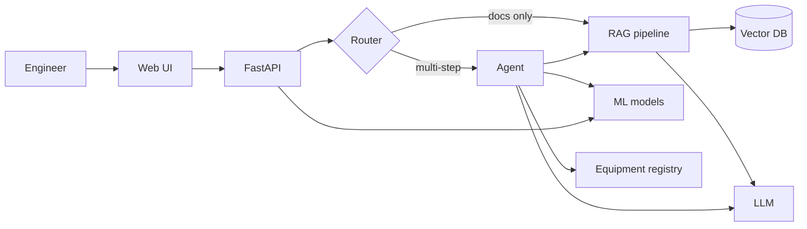

# Industrial AI Copilot


**A decision-support prototype that combines retrieval-augmented generation (RAG) over technical documentation with predictive maintenance on equipment sensor data.**

> [!IMPORTANT]
> All industrial documentation used in this project is synthetic and created exclusively for demonstration purposes. This is an independent, educational proof of concept: it is not affiliated with or built for any company, it uses no private or confidential data, and it must not be used for real operational decisions.

   **Status:** ✅ Phase 1 (dataset and machine learning) complete · next: Phase 2, synthetic technical documents. See the [roadmap](#roadmap).

## Overview

Industrial AI Copilot helps plant engineers answer two kinds of questions:

- **"What does the documentation say?"** — e.g. *What is the maximum exhaust gas temperature of GT-101?* Answered with RAG, always citing document, page and section.
- **"What is the equipment doing?"** — e.g. *Does GT-101 show a high risk of failure?* Answered with machine-learning models trained on sensor data, together with the variables that most influenced the prediction.

A read-only agent combines both when a question needs it, e.g. *Is GT-101 behaving anomalously, and which maintenance procedure applies?*

The guiding principle is **no evidence → no confident answer**: when the system cannot find supporting evidence, it says so and indicates which document or data would be needed.

## Problem

ACME Process Energy (a **fictitious** company) operates process plants whose critical rotating equipment includes two aeroderivative gas turbine units, **GT-101** and **GT-102**. Technical knowledge is spread across long manuals and procedures, and maintenance is mostly calendar-based or reactive. Engineers lose time searching for exact values and get little early warning of degradation.

Typical questions:

- What are the operating conditions of GT-101?
- What is the maximum allowed exhaust gas temperature?
- What procedure must be followed after a high-temperature alarm?
- What is the difference between GT-101 and GT-102?
- Is there a recent anomaly in the behaviour of GT-101?
- Which documents support this answer?

## Architecture



Full design in [docs/architecture.md](docs/architecture.md) · design decisions and trade-offs in [docs/decisions.md](docs/decisions.md).

## Features

- [x] Failure-risk prediction (probability of failure within 30 cycles) with the main contributing variables (Phase 1)
- [x] Unsupervised anomaly detection against a healthy reference, with the most deviating variables (Phase 1)
- [ ] Synthetic, internally consistent technical documentation (Phase 2)
- [ ] RAG with citations, evidence gate and numeric grounding check (Phase 3)
- [ ] Read-only agent with real tools (Phase 4)
- [ ] REST API with validated schemas and Swagger docs (Phase 5)
- [ ] Simple web UI (Phase 6)
- [ ] One-command deployment with Docker Compose (Phase 7)

## Tech Stack

| Layer | Choice |
|---|---|
| Language | Python 3.12 |
| Data & ML | pandas, NumPy, SciPy, scikit-learn, XGBoost |
| LLM | Ollama (local, default) or OpenAI, behind a provider interface |
| Embeddings | sentence-transformers (Hugging Face) |
| Vector store | ChromaDB |
| Relational store | SQLite via SQLAlchemy (PostgreSQL-ready) |
| API | FastAPI + Pydantic |
| UI | Streamlit |
| Quality | pytest, Ruff, pre-commit, GitHub Actions |
| Deployment | Docker, Docker Compose |

## Dataset

Sensor data comes from the **NASA C-MAPSS** turbofan engine degradation simulation, subset **FD001**: run-to-failure trajectories of 100 training engines with 3 operational settings and 21 sensor channels, under one operating condition and one fault mode.

C-MAPSS simulates an aircraft turbofan. It is used here as a **proxy** for the degradation of an aeroderivative gas turbine, which is derived from aircraft engines and shares its gas-generator core. This is an approximation, not a model of a real industrial unit (see [Limitations](#limitations)). The fictitious assets GT-101 and GT-102 are mapped to C-MAPSS engine units in the equipment registry.

The raw data is not redistributed in this repository; it is downloaded by a script (Phase 1).

> Reference: A. Saxena, K. Goebel, D. Simon and N. Eklund, "Damage Propagation Modeling for Aircraft Engine Run-to-Failure Simulation", *International Conference on Prognostics and Health Management (PHM)*, 2008.

## ML Pipeline

Two complementary models on the sensor history of each unit, both validated with cross-validation grouped by unit (never by row) and evaluated once on the official test set. Details in [docs/ml.md](docs/ml.md), decisions in [docs/decisions.md](docs/decisions.md).

| | Failure classifier | Anomaly detector |
|---|---|---|
| Question | Will this unit fail within 30 cycles? | Has it started to deviate from healthy operation? |
| Method | Logistic regression on past-only features (rolling level, deviation from the unit's own baseline, trend) and the unit's age | Max \|z-score\| of the deviation features against a healthy reference; no failure labels |
| Decision rule | Threshold 0.748: recall ≥ 0.90 on out-of-fold scores | 1% false-alarm budget on healthy cycles; alarm after 3 consecutive cycles |
| Key result | PR-AUC 0.991 ± 0.001; test (last cycle per unit): precision 1.000, recall 0.920 | No missed units; median warning 109 cycles before failure |
| Explanation | Exact contribution of each feature to the log-odds | Features with the largest deviation from healthy |

The detector warns early (degradation has started); the classifier says when it becomes urgent. On the test set, the only unit the classifier clearly missed was flagged by the detector.

## RAG Pipeline

*Implemented in Phase 3.* Ingestion (PDF → text → metadata → chunks → embeddings → vector store) is separated from retrieval and generation. Answers include document, page, section and the supporting fragments. Details in [docs/rag.md](docs/rag.md).

## Agent

*Implemented in Phase 4.* A small, auditable tool-calling loop with read-only tools: `search_documents`, `get_equipment_information`, `predict_failure`, `detect_anomaly`, `compare_equipment` and `retrieve_maintenance_procedure`. Details in [docs/agent.md](docs/agent.md).

## API

*Implemented in Phase 5.* Interactive Swagger documentation will be available at `http://localhost:8000/docs`.

| Method | Endpoint | Purpose |
|---|---|---|
| POST | `/ask` | Question answering (RAG or agent) |
| POST | `/predict` | Failure-risk prediction |
| POST | `/anomaly` | Anomaly score |
| POST | `/documents/ingest` | Ingest a new document |
| GET | `/equipment/{equipment_id}` | Equipment data sheet |
| POST | `/compare` | Compare two units |
| GET | `/health` | Health check |

## Demo

*A 5-minute walkthrough will be added in Phase 10.*

## Installation

Development setup (current phase):

```bash
git clone https://github.com/maria2332/industrial-ai-copilot.git
cd industrial-ai-copilot
python -m venv .venv
source .venv/bin/activate          # Windows: .venv\Scripts\activate
pip install -e ".[dev,ml]"
pre-commit install
cp .env.example .env               # Windows: copy .env.example .env
```

## Usage

Train and save the models (Phase 1):

```bash
python scripts/download_data.py    # NASA C-MAPSS, with checksums
python scripts/train.py            # saves models/failure_classifier/1.0.0 and models/anomaly_detector/1.0.0
```

Predict for one unit from its complete sensor history:

```python
from industrial_ai.ml.data import load_trajectories
from industrial_ai.ml.inference import Predictor

predictor = Predictor.load()
test = load_trajectories("FD001", "test")
history = test[test["unit"] == 18]

print(predictor.predict_failure(history).as_dict())  # probability, threshold, top features
print(predictor.detect_anomaly(history).as_dict())  # margin, sustained alarm, top deviations
```

The exploration behind every decision is in `notebooks/01_data_exploration.ipynb` and `notebooks/02_predictive_maintenance.ipynb`. The API (Phase 5) and `docker compose up` (Phase 7) come later.

## Testing

```bash
pytest
ruff check .
ruff format --check .
```

The same checks run automatically on GitHub Actions for every push to `main` and every pull request.

## Evaluation

**ML (Phase 1)** — grouped 5-fold cross-validation on 100 training units; official test set used once:

| Metric | Cross-validation (out-of-fold) | Test, every cycle | Test, last cycle per unit |
|---|---|---|---|
| Prevalence (random-model PR-AUC) | 0.150 | 0.025 | 0.250 |
| Classifier PR-AUC | 0.991 | 0.955 | 0.997 |
| Classifier precision / recall at 0.748 | 0.979 / 0.902 | 0.943 / 0.798 | 1.000 / 0.920 |
| Calibration error (ECE) | 0.003 | 0.002 | — |
| Detector false alarms on healthy cycles | 1.4% | — | — |
| Detector warning (median / minimum, cycles before failure) | 109 / 62 | — | — |

The lower test recall on every cycle comes from the mix of cycles (most test positives lie close to the 30-cycle horizon), not from a weaker model: recall within each distance-to-failure band matches cross-validation.

*Planned for later phases:*

- **RAG:** retrieval hit@k and MRR, exact numeric correctness (with units), citation correctness, groundedness and correct abstention on unanswerable questions.
- **Agent:** tool-selection accuracy, task completion and documented failure cases.
- **API:** p50/p95 latency and error-path coverage.

## Limitations

- Sensor data comes from a public **simulation** of an aircraft turbofan, used as a proxy; real plant data would differ in noise, sampling, operating regimes and failure modes.
- All technical documentation is **synthetic**.
- Models are **not validated for production** and the decision threshold reflects assumptions, not a real cost analysis.
- The linear classifier gives each sensor a single direction; a unit whose core speed falls instead of rising can be underestimated (one confident miss on the test set, which the anomaly detector flagged).
- The LLM can make mistakes; mitigations reduce but do not eliminate this risk.
- RAG quality depends on the quality and coverage of the documentation.
- The failure model uses the unit's age (`cycle`), which may partly reflect the lifetimes of this simulated fleet; units with very different lives could be misjudged.
- Anomaly detection and feature attributions show **correlations, not causes**.
- The system must not be used for real operational or safety decisions.

## Safety Considerations

- **Human-in-the-loop:** the system informs an engineer; it never acts.
- **No autonomous control:** no tool can modify equipment, parameters or plant state. All tools are read-only.
- **No safety-critical decisions:** answers are decision support only and state their uncertainty.
- **No private company data and no personal data** are used.

## Future Work

Computer vision for inspection, OCR, multimodal RAG, digital twins, real-time streaming (Kafka), experiment tracking (MLflow), PostgreSQL + pgvector, drift monitoring, human feedback loops, systematic LLM evaluation, fine-tuning where justified, multimodal agents and other C-MAPSS subsets (FD002–FD004).

## Roadmap

| Phase | Scope | Status |
|---|---|---|
| 0 | Architecture and scaffolding | ✅ Done |
| 1 | Dataset + ML | ✅ Done |
| 2 | Synthetic technical documents | ⏳ |
| 3 | RAG | ⏳ |
| 4 | Agent | ⏳ |
| 5 | FastAPI | ⏳ |
| 6 | Frontend | ⏳ |
| 7 | Docker | ⏳ |
| 8 | Testing | ⏳ |
| 9 | Evaluation | ⏳ |
| 10 | Documentation and demo | ⏳ |
| 11 | Interview preparation | ⏳ |

## Author

**María Arribas Ballesteros** — Mathematical Engineering graduate (Artificial Intelligence specialisation), CEU San Pablo University.

[LinkedIn](<https://www.linkedin.com/in/mar%C3%ADa-arribas-ballesteros>) · [GitHub](https://github.com/maria2332)
