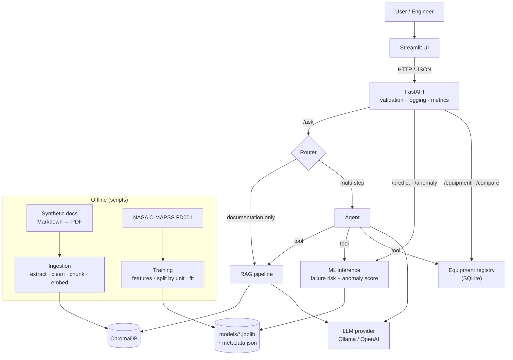
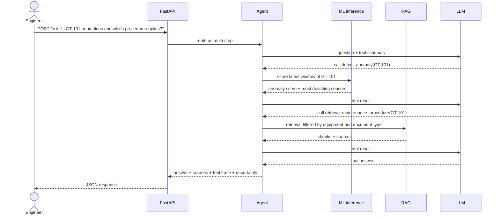
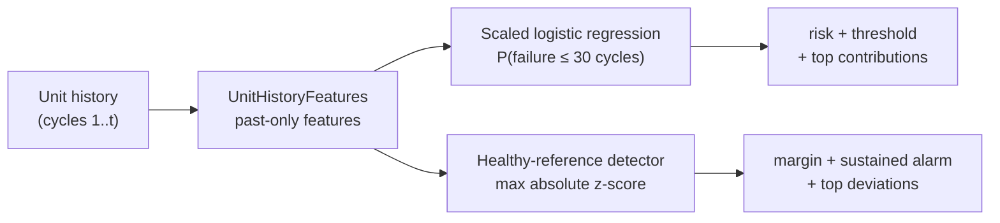
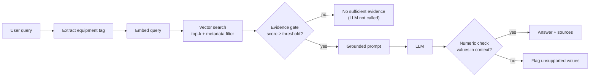

# Architecture

> **Status:** Phase 0 (design). Sections marked *Planned* are implemented in later phases and will be updated with the final design.

## 1. Problem

ACME Process Energy is a **fictitious** operator of process plants. Its critical rotating equipment includes two aeroderivative gas turbine units, **GT-101** and **GT-102**. Engineers need to:

- find exact technical values (operating limits, alarm thresholds, maintenance intervals) in long manuals;
- know whether a unit shows signs of degradation before it fails;
- combine both, e.g. *"Is GT-101 behaving abnormally, and which procedure applies?"*

The system is a **decision-support prototype**: it informs a human and never acts on equipment.

## 2. Architecture

Design principles:

1. **Training is separated from inference.** Models are trained offline by a script; the API only loads versioned artifacts at startup.
2. **Ingestion is separated from retrieval and generation.** Embeddings are computed once at ingestion time, never per question.
3. **Providers are swappable.** LLMs and embedding models sit behind abstract interfaces; switching provider is a configuration change.
4. **Not everything is an agent.** A router sends documentation-only questions straight to the RAG pipeline; only multi-step questions reach the agent. `/predict` and `/anomaly` never call an LLM.
5. **Defence in depth against hallucinations.** An evidence gate abstains without calling the LLM when retrieval finds nothing relevant; the prompt requires citations and abstention; a post-check verifies that every numeric value in the answer appears in the retrieved context.

## 3. Components

| Component | Package | Responsibility | Phase |
|---|---|---|---|
| Configuration | `industrial_ai.config` | Typed settings loaded from `.env` | 1 |
| ML | `industrial_ai.ml` | Data validation, features, training, evaluation, inference, model registry | 1 |
| Equipment registry | `industrial_ai.equipment` | Master data of GT-101/GT-102 and mapping to C-MAPSS units | 1–2 |
| Ingestion | `industrial_ai.ingestion` | PDF extraction, cleaning, metadata, chunking | 3 |
| LLM providers | `industrial_ai.llm` | `LLMProvider` and `EmbeddingProvider` interfaces and implementations | 3 |
| RAG | `industrial_ai.rag` | Vector store, retriever, evidence gate, prompts, grounded generation | 3 |
| Agent | `industrial_ai.agents` | Tool registry, agent loop, guardrails | 4 |
| API | `industrial_ai.api` | Routers, schemas, middleware, error handling | 5 |
| Evaluation | `industrial_ai.evaluation` | Reusable metrics: alarm thresholds and confusion-matrix metrics (Phase 1), RAG and agent metrics (Phases 3–4), global report (Phase 9) | 1, 3, 4, 9 |
| Utilities | `industrial_ai.utils` | Structured logging, timing, request IDs | 5 |

Main interfaces between components:

| Interface | Input | Output |
|---|---|---|
| `EmbeddingProvider.embed` | list of texts | list of vectors |
| `LLMProvider.generate` | messages + optional tool schemas | text and/or tool calls |
| `Retriever.search` | query, k, metadata filters | chunks with score and metadata |
| `FailureModel.predict` | sensor window of one unit | label, probability, top features, model version |
| `AnomalyDetector.score` | sensor window of one unit | anomaly score, flag, most deviating variables |
| `EquipmentRegistry.get` | equipment_id | data sheet or typed "not found" error |

## 4. Data flow

**Offline** (scripts, run once or when data changes):

- *Documents:* synthetic Markdown sources → PDF → text extraction → cleaning → metadata → chunking → embeddings → ChromaDB.
- *Sensor data:* C-MAPSS download → validation → labels → features → split by engine unit → training → evaluation → versioned artifacts in `models/`.

**Online** (per request). Example of a combined question handled by the agent:

## 5. ML pipeline (*Implemented — Phase 1*)

Details, results and decisions in [ml.md](ml.md).

- **Data:** C-MAPSS FD001 train, test and RUL files, downloaded by a script that records their checksums (not committed). Structural validation at load time.
- **Labels:** remaining useful life per cycle; binary target "failure within the next 30 cycles". Test labels are reconstructed for every cycle from the RUL file.
- **Features:** 14 sensors selected in the EDA; per sensor, a 10-cycle rolling mean, its deviation from the unit's own early-life baseline and its 10-cycle trend, all computed from past cycles only; plus the unit's age (D-016, D-017, D-018).
- **Validation:** cross-validation grouped by unit (5 folds) for every comparison and for the decision threshold; the official test set is used once (D-003).
- **Failure classifier:** logistic regression, selected among four candidates with a pre-registered rule (D-015); threshold with recall ≥ 0.90 on out-of-fold scores (D-019).
- **Anomaly detector:** max |z-score| of the deviation features against a healthy reference (cycles 20–60), label-free threshold with a 1% false-alarm budget, alarm after 3 consecutive cycles (D-021).
- **Explainability:** exact linear contributions (local and global) and permutation importance grouped by sensor (global, out-of-fold), presented as model attributions, not causes (D-022).
- **Persistence and inference:** `scripts/train.py` saves both models with joblib and a `metadata.json` (version, environment, data checksums, decision policy, metrics); `Predictor` loads them once and answers per-unit questions (D-023).

## 6. RAG pipeline (*Planned — Phase 3*)

Every chunk keeps its metadata: `document`, `page`, `section`, `equipment`, `document_type`. Chunking strategies (fixed size with overlap, paragraph-based, heading-aware) are compared with retrieval metrics before choosing one.

## 7. Agent architecture (*Planned — Phase 4*)

| Tool | Backed by | Purpose |
|---|---|---|
| `search_documents` | RAG retriever | Free-text search in the documentation |
| `get_equipment_information` | Equipment registry | Data sheet of a unit |
| `predict_failure` | ML inference | Failure-risk probability and top features |
| `detect_anomaly` | ML inference | Anomaly score and most deviating variables |
| `compare_equipment` | Registry + RAG | Side-by-side comparison of two units |
| `retrieve_maintenance_procedure` | RAG (filtered by document type) | Relevant maintenance procedure |

The loop has a maximum number of steps, validates every tool input and output with Pydantic, and returns the tool trace with the answer. **All tools are read-only.**

## 8. API (*Planned — Phase 5*)

| Method | Endpoint | Purpose |
|---|---|---|
| POST | `/ask` | Question answering (router → RAG or agent) |
| POST | `/predict` | Failure-risk prediction |
| POST | `/anomaly` | Anomaly score |
| POST | `/documents/ingest` | Ingest a new document |
| GET | `/equipment/{equipment_id}` | Equipment data sheet |
| POST | `/compare` | Compare two units |
| GET | `/health` | Health check |
| GET | `/metrics` | Basic latency, request and error counters |

Models and the vector store are loaded once at startup. Errors are returned as typed JSON without stack traces; every response includes a request ID and, where relevant, the model version.

## 9. Deployment (*Planned — Phase 7*)

Docker Compose with an `api` service (FastAPI + Uvicorn) and a `ui` service (Streamlit). Model artifacts and the vector store are mounted as volumes. Whether Ollama runs on the host or as a Compose service is decided in Phase 7.

## 10. Security

- Secrets only in `.env` (git-ignored); `.env.example` documents the variables.
- Retrieved text is treated as **data, not instructions** (prompt-injection mitigation), and the agent has no tools with side effects.
- Input validation on every endpoint; size and type limits for uploaded PDFs.
- Logs never contain API keys, secrets or full prompts.
- Dependency monitoring with Dependabot; secret detection in pre-commit.
- No authentication in this local PoC (declared limitation).

## 11. Limitations

See the [Limitations section of the README](../README.md#limitations).
